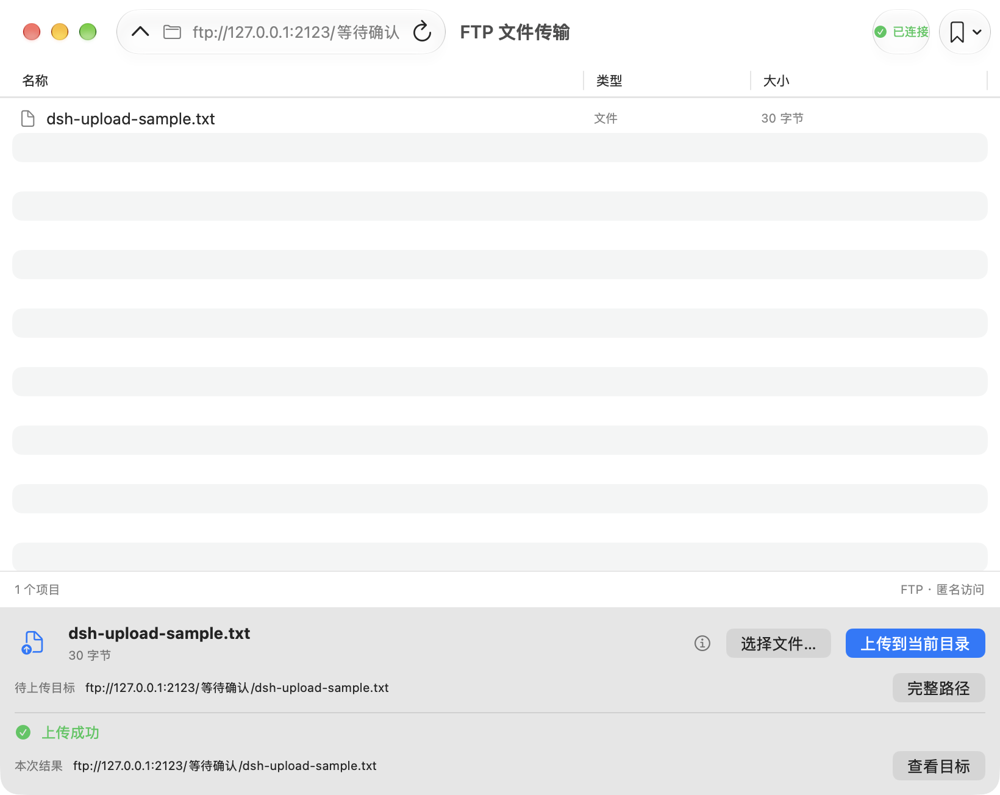

<p align="center">
  
</p>

<h1 align="center">FTP 文件传输</h1>

<p align="center"><strong>连接服务器，找到目录，上传文件。</strong></p>
<p align="center">一款轻量的 macOS FTP 客户端，让日常文件上传更直观。</p>

<p align="center">
  <a href="https://github.com/Lanjunyee/FTPUploader/releases/latest">下载安装</a> ·
  <a href="#能做什么">功能介绍</a> ·
  <a href="#开始使用">开始使用</a>
</p>

<p align="center"><sub>原生 macOS 界面 · Apple Silicon 与 Intel 通用安装包 · 浅色与深色外观</sub></p>

---

<p align="center">
  
  <br>
  <sub>目录浏览与文件上传集中在一个窗口。截图使用本机测试服务器。</sub>
</p>

## 能做什么

- **连接 FTP** — 支持匿名或账户密码登录。
- **管理常用站点** — 保存服务器配置，按需将密码存入系统钥匙串。
- **浏览远程目录** — 双击进入文件夹，按名称、类型或大小排序。
- **上传单个文件** — 查看进度、目标路径和结果，服务器确认后才显示成功。

适合向已有 FTP 服务器提交作业、文档或其他文件。

## 开始使用

1. 从 [Releases](https://github.com/Lanjunyee/FTPUploader/releases/latest) 下载通用 ZIP 安装包，解压后将 `FTPUploader.app` 放入“应用程序”文件夹。
2. 填写服务器地址，例如 `ftp://example.com:21/uploads`，选择登录方式，点击“连接”。
3. 双击进入目标文件夹，点击“选择文件…” → “上传到当前目录”，等待“上传成功”。

常用服务器可在站点菜单或“设置…”中保存，下次选择后点击“连接”即可。

## 使用前了解

- 当前仅支持**普通 FTP**，网络传输不加密；钥匙串仅保护本机保存的密码。
- 每次上传一个文件，暂不支持下载、文件夹或批量上传、续传、SFTP / FTPS。
- 同名文件可能被服务器覆盖；传输中断后可能留下部分文件，应用不会自动删除或重试。
- 当前安装包采用本地签名，**未经过 Apple 公证**，首次打开可能被 macOS 拦截。
- 系统 API 基线为 macOS 13；最低系统版本和 Intel 真机运行尚未实测。

---

## 开发

SwiftUI / AppKit 构建原生界面，系统 libcurl 负责 FTP 传输，无第三方包依赖。

<details>
<summary>构建、测试与本机 FTP 夹具</summary>

### 构建与运行

需要 Xcode 及 macOS SDK。打开 `FTPUploader.xcodeproj`，选择 FTPUploader scheme，或运行：

```sh
./script/build_and_run.sh --verify
```

产物位于 `dist/FTPUploader.app`。脚本还支持 `--debug`、`--logs` 与 `--telemetry`。

### 自动化测试

```sh
xcodebuild -project FTPUploader.xcodeproj -scheme FTPUploader \
  -destination 'platform=macOS,arch=arm64' -derivedDataPath .build/xcode test
```

测试环境需要 macOS 14 或更新版本。测试覆盖地址与目录编码、站点和凭据管理、错误脱敏及上传结果等行为。

### 本机 FTP 夹具

```sh
/usr/bin/python3 script/ftp_fixture.py --port 2121
```

连接 `ftp://127.0.0.1:2121`。服务仅监听本机地址，使用临时数据，停止后自动清理。

</details>
